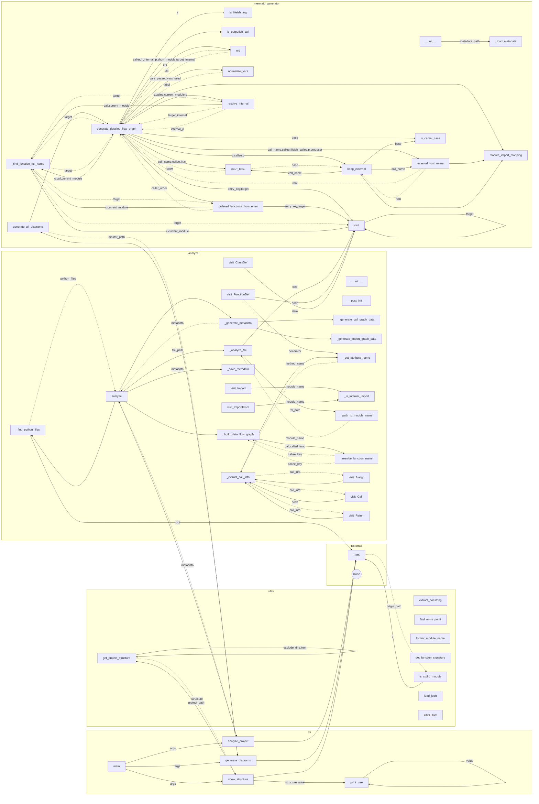

# Project Flow Diagrams

## Detailed Flow

```mermaid
graph LR
    subgraph mermaid_generator [mermaid_generator]
        mermaid_generator___init__[__init__]
        mermaid_generator__find_function_full_name[_find_function_full_name]
        mermaid_generator__load_metadata[_load_metadata]
        mermaid_generator_external_root_name[external_root_name]
        mermaid_generator_generate_all_diagrams[generate_all_diagrams]
        mermaid_generator_generate_detailed_flow_graph[generate_detailed_flow_graph]
        mermaid_generator_is_camel_case[is_camel_case]
        mermaid_generator_is_fileish_arg[is_fileish_arg]
        mermaid_generator_is_outputish_call[is_outputish_call]
        mermaid_generator_keep_external[keep_external]
        mermaid_generator_module_import_mapping[module_import_mapping]
        mermaid_generator_nid[nid]
        mermaid_generator_normalize_vars[normalize_vars]
        mermaid_generator_ordered_functions_from_entry[ordered_functions_from_entry]
        mermaid_generator_resolve_internal[resolve_internal]
        mermaid_generator_short_label[short_label]
        mermaid_generator_visit[visit]
    end
    subgraph utils [utils]
        utils_extract_docstring[extract_docstring]
        utils_find_entry_point[find_entry_point]
        utils_format_module_name[format_module_name]
        utils_get_function_signature[get_function_signature]
        utils_get_project_structure[get_project_structure]
        utils_is_stdlib_module[is_stdlib_module]
        utils_load_json[load_json]
        utils_save_json[save_json]
    end
    subgraph analyzer [analyzer]
        analyzer___init__[__init__]
        analyzer___post_init__[__post_init__]
        analyzer__analyze_file[_analyze_file]
        analyzer__build_data_flow_graph[_build_data_flow_graph]
        analyzer__extract_call_info[_extract_call_info]
        analyzer__find_python_files[_find_python_files]
        analyzer__generate_call_graph_data[_generate_call_graph_data]
        analyzer__generate_import_graph_data[_generate_import_graph_data]
        analyzer__generate_metadata[_generate_metadata]
        analyzer__get_attribute_name[_get_attribute_name]
        analyzer__is_internal_import[_is_internal_import]
        analyzer__path_to_module_name[_path_to_module_name]
        analyzer__resolve_function_name[_resolve_function_name]
        analyzer__save_metadata[_save_metadata]
        analyzer_analyze[analyze]
        analyzer_visit_Assign[visit_Assign]
        analyzer_visit_Call[visit_Call]
        analyzer_visit_ClassDef[visit_ClassDef]
        analyzer_visit_FunctionDef[visit_FunctionDef]
        analyzer_visit_Import[visit_Import]
        analyzer_visit_ImportFrom[visit_ImportFrom]
        analyzer_visit_Return[visit_Return]
    end
    subgraph cli [cli]
        cli_analyze_project[analyze_project]
        cli_generate_diagrams[generate_diagrams]
        cli_main[main]
        cli_print_tree[print_tree]
        cli_show_structure[show_structure]
    end
    subgraph External [External]
        ext_pathlib_Path[Path]
        Done((Done))
    end
    mermaid_generator___init__ --> |metadata_path| mermaid_generator__load_metadata
    mermaid_generator_generate_detailed_flow_graph --> mermaid_generator_module_import_mapping
    mermaid_generator_generate_detailed_flow_graph --> |call_name,callee,fn,n| mermaid_generator_short_label
    mermaid_generator_generate_detailed_flow_graph --> |call_name,callee,fileish_callee,p,producer| mermaid_generator_external_root_name
    mermaid_generator_generate_detailed_flow_graph --> |base| mermaid_generator_is_camel_case
    mermaid_generator_generate_detailed_flow_graph --> |c,call,current_module| mermaid_generator__find_function_full_name
    mermaid_generator_generate_detailed_flow_graph --> |entry_key,target| mermaid_generator_visit
    mermaid_generator_generate_detailed_flow_graph --> |caller,fn,internal_p,short_module,target_internal| mermaid_generator_nid
    mermaid_generator_generate_detailed_flow_graph --> |c,callee,current_module,p| mermaid_generator_resolve_internal
    mermaid_generator_generate_detailed_flow_graph --> |c,callee,p| mermaid_generator_keep_external
    mermaid_generator_generate_detailed_flow_graph --> mermaid_generator_is_outputish_call
    mermaid_generator_generate_detailed_flow_graph --> mermaid_generator_ordered_functions_from_entry
    mermaid_generator_generate_detailed_flow_graph --> |vars_passed,vars_used| mermaid_generator_normalize_vars
    mermaid_generator_generate_detailed_flow_graph --> |a| mermaid_generator_is_fileish_arg
    mermaid_generator_external_root_name --> mermaid_generator_module_import_mapping
    mermaid_generator_keep_external --> |call_name| mermaid_generator_short_label
    mermaid_generator_keep_external --> |call_name| mermaid_generator_external_root_name
    mermaid_generator_keep_external --> mermaid_generator_module_import_mapping
    mermaid_generator_keep_external --> |base| mermaid_generator_is_camel_case
    mermaid_generator_resolve_internal --> |call,current_module| mermaid_generator__find_function_full_name
    mermaid_generator_ordered_functions_from_entry --> |c,current_module| mermaid_generator__find_function_full_name
    mermaid_generator_ordered_functions_from_entry --> |entry_key,target| mermaid_generator_visit
    mermaid_generator_visit --> |c,current_module| mermaid_generator__find_function_full_name
    mermaid_generator_visit --> |target| mermaid_generator_visit
    mermaid_generator_generate_all_diagrams --> mermaid_generator_generate_detailed_flow_graph
    utils_is_stdlib_module --> |p| ext_pathlib_Path
    utils_get_project_structure --> |exclude_dirs,item| utils_get_project_structure
    analyzer_analyze --> analyzer__find_python_files
    analyzer_analyze --> |file_path| analyzer__analyze_file
    analyzer_analyze --> analyzer__build_data_flow_graph
    analyzer_analyze --> analyzer__generate_metadata
    analyzer_analyze --> |metadata| analyzer__save_metadata
    analyzer__find_python_files --> |root| ext_pathlib_Path
    analyzer__analyze_file --> |rel_path| analyzer__path_to_module_name
    analyzer__analyze_file --> |tree| mermaid_generator_visit
    analyzer__build_data_flow_graph --> |call,called_func| analyzer__resolve_function_name
    analyzer__generate_metadata --> analyzer__generate_call_graph_data
    analyzer__generate_metadata --> analyzer__generate_import_graph_data
    analyzer_visit_Import --> |module_name| analyzer__is_internal_import
    analyzer_visit_ImportFrom --> |module_name| analyzer__is_internal_import
    analyzer_visit_FunctionDef --> |decorator| analyzer__get_attribute_name
    analyzer_visit_FunctionDef --> |node| mermaid_generator_visit
    analyzer_visit_ClassDef --> |item| mermaid_generator_visit
    analyzer_visit_Assign --> analyzer__extract_call_info
    analyzer_visit_Call --> |node| analyzer__extract_call_info
    analyzer_visit_Return --> analyzer__extract_call_info
    analyzer__extract_call_info --> analyzer__get_attribute_name
    cli_main --> |args| cli_analyze_project
    cli_main --> |args| cli_generate_diagrams
    cli_main --> |args| cli_show_structure
    cli_analyze_project --> ext_pathlib_Path
    cli_analyze_project --> analyzer_analyze
    cli_generate_diagrams --> ext_pathlib_Path
    cli_generate_diagrams --> mermaid_generator_generate_all_diagrams
    cli_show_structure --> ext_pathlib_Path
    cli_show_structure --> |structure,value| cli_print_tree
    cli_show_structure --> |project_path| utils_get_project_structure
    cli_print_tree --> |value| cli_print_tree
    mermaid_generator_short_label -.->|base| mermaid_generator_generate_detailed_flow_graph
    mermaid_generator_external_root_name -.->|root| mermaid_generator_generate_detailed_flow_graph
    mermaid_generator__find_function_full_name -.->|target| mermaid_generator_generate_detailed_flow_graph
    mermaid_generator__find_function_full_name -.->|target| mermaid_generator_generate_detailed_flow_graph
    mermaid_generator_ordered_functions_from_entry -.->|caller_order| mermaid_generator_generate_detailed_flow_graph
    mermaid_generator_nid -.->|src| mermaid_generator_generate_detailed_flow_graph
    mermaid_generator_resolve_internal -.->|target_internal| mermaid_generator_generate_detailed_flow_graph
    mermaid_generator_normalize_vars -.->|label| mermaid_generator_generate_detailed_flow_graph
    mermaid_generator_nid -.->|dst| mermaid_generator_generate_detailed_flow_graph
    mermaid_generator_resolve_internal -.->|internal_p| mermaid_generator_generate_detailed_flow_graph
    mermaid_generator_short_label -.->|base| mermaid_generator_keep_external
    mermaid_generator_external_root_name -.->|root| mermaid_generator_keep_external
    mermaid_generator__find_function_full_name -.->|target| mermaid_generator_resolve_internal
    mermaid_generator__find_function_full_name -.->|target| mermaid_generator_ordered_functions_from_entry
    mermaid_generator__find_function_full_name -.->|target| mermaid_generator_visit
    ext_pathlib_Path -.->|origin_path| utils_is_stdlib_module
    analyzer__find_python_files -.->|python_files| analyzer_analyze
    analyzer__generate_metadata -.->|metadata| analyzer_analyze
    analyzer__path_to_module_name -.->|module_name| analyzer__analyze_file
    analyzer__resolve_function_name -.->|callee_key| analyzer__build_data_flow_graph
    analyzer__resolve_function_name -.->|callee_key| analyzer__build_data_flow_graph
    analyzer__extract_call_info -.->|call_info| analyzer_visit_Assign
    analyzer__extract_call_info -.->|call_info| analyzer_visit_Call
    analyzer__extract_call_info -.->|call_info| analyzer_visit_Return
    analyzer__get_attribute_name -.->|method_name| analyzer__extract_call_info
    analyzer_analyze -.->|metadata| cli_analyze_project
    mermaid_generator_generate_all_diagrams -.->|master_path| cli_generate_diagrams
    utils_get_project_structure -.->|structure| cli_show_structure
```

